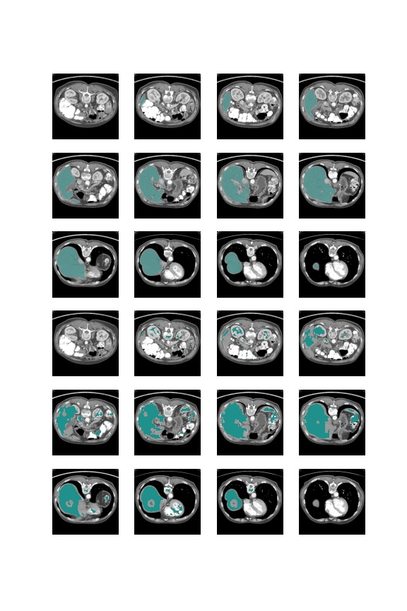
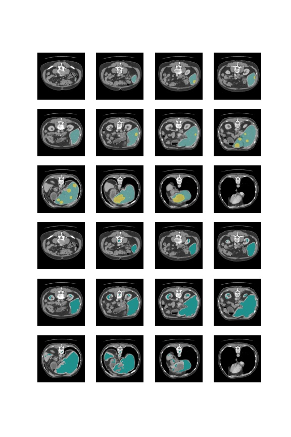

# 3d Dense UNet

Pytorch implementation of [Alalwan et al. in this paper](https://www.sciencedirect.com/science/article/pii/S1110016820305639) with some architectural decisions from [Li et al. in this paper](https://arxiv.org/pdf/1709.07330.pdf).

This network was built up and trained to segment livers and liver lesions from the [LiTS Dataset](https://competitions.codalab.org/competitions/17094). It is structured as a very deep UNet with repeating dense blocks in the down direction and upsampling blocks in the up direction. The overall depth of this model is approximately 150 convolutional layers.

The model seeks to segment livers and lesions via only 3d CT scans. 

# How to Run

1. Install the dependences in requirements.txt
2. Download your data. In theory, this model should work for any 3d CT scans, not just liver, but we have not tested on datasets besides LiTS.
3. Configure your project through `./config.yaml`. Make sure that the dataset path links to your dataset folder.
4. Run `cp ./dense_unet_3d/main.py .; python main.py`

On a single GTX1080 GPU, a run with batch size of 3 took approximately 6.4 GB of dedicated GPU memory. Training on 50 epochs took 9.5 hours. 

# Results

At our final iteration of the model, we reached a liver dice score of approximately 0.7. We were unable to detect lesions in the second phase. 

Average Case Segmentation       | Best Case Segmentation
:------------------------------:|:------------------------------:
        | 

Top 3 rows are 12 equidistant ground truth segmentations of a single scan. Bottom 3 rows are the equivalent segmentations generated by our model.

# Disclaimer

Our model and methods need much more work and training to reach the results that are presented in the paper. We are not currently actively developing this model.

# Acknowledgement
This work has been done by [nguyenjus](https://github.com/NguyenJus) and [wang1784](https://github.com/wang1784). This work was completed in part using the Discovery cluster, supported by Northeastern University’s Research Computing team.