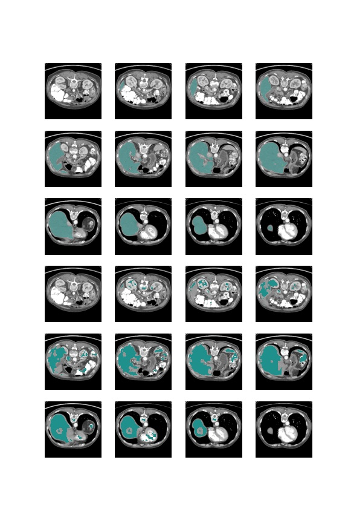
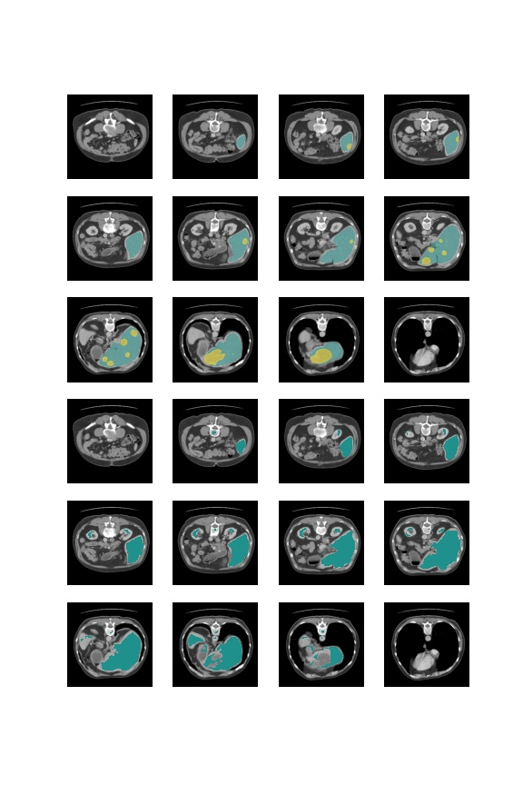

# 3D-DenseUNet-569

A paper-faithful PyTorch implementation of **3D-DenseUNet-569** from
[Alalwan et al., *Alexandria Engineering Journal* 60 (2021) 1231–1239][paper],
with architectural gap-fills from [Li et al., H-DenseUNet, arXiv:1709.07330][hdense].

The model segments **livers (class 1) and liver lesions (class 2)** in 3D CT
volumes from the [LiTS-2017 dataset][lits].
It uses real dense connectivity, 3D depthwise-separable convolutions (growth
rate 32, bottleneck 128), and a 5-level U-Net decoder.
See [Architecture fidelity](#architecture-fidelity) for why the shipped block
counts differ from the paper's figure.

[paper]: https://www.sciencedirect.com/science/article/pii/S1110016820305639
[hdense]: https://arxiv.org/pdf/1709.07330.pdf
[lits]: https://competitions.codalab.org/competitions/17094

---

## Install

```bash
pip install -e .
```

Requires Python 3.11+, PyTorch 2.x, nibabel, pyyaml, tqdm, matplotlib.
A CPU-only install is sufficient for all tests; a CUDA-capable GPU is needed
only for the full training run.

---

## Usage

The package installs a `dense-unet-3d` console entry point.
All subcommands take `--config <path/to/config.yaml>`.

### Train

```bash
dense-unet-3d train --config config.yaml
```

Runs the cascaded 2-phase training schedule (Phase A: 100 epochs × 10 steps;
Phase B: reload best checkpoint, 1000 epochs × 10 steps).
Checkpoints are written to the path specified in `config.yaml`.

### Evaluate

```bash
dense-unet-3d eval --config config.yaml --checkpoint <path/to/best.pt>
```

Evaluates on the seeded 80/20 validation holdout and prints liver and tumor
Dice scores (per-case and global).

### Predict

```bash
dense-unet-3d predict --config config.yaml --checkpoint <path/to/best.pt> \
    --input <volume.nii.gz> --output <segmentation.nii.gz>
```

Runs inference on a single NIfTI volume and writes the predicted segmentation.

---

## Data setup

1. Download the [LiTS-2017 dataset][lits] (131 labeled training volumes).
2. Set `dataset_path` in `config.yaml` to point to your data directory.
3. HU values are truncated to `[−200, 250]`; volumes are resized to
   `224×224×12`.

The train/validation split is a **fixed, seeded 80/20 holdout** of the 131
labeled volumes (approximately 105 train / 26 val), controlled by `split_seed`
and `val_fraction` in `config.yaml`.
The split is deterministic: the same seed always produces the same file lists,
and the two sets are disjoint.

---

## Architecture fidelity

This repository ships a **reduced-depth variant**, not a literally 569-layer
model.
The name "DenseUNet-569" encodes the paper's full block counts (4, 12, 24, 36)
and authoritative hyperparameters; the shipped implementation uses half-scale
block counts **(2, 6, 12, 18)** — preserving the paper's 1:3:6:9 ratio —
while keeping all other authoritative values unchanged:

- growth rate **g = 32** (authoritative, unchanged)
- bottleneck **128** channels (authoritative, unchanged)
- transition compression **0.5** (authoritative, unchanged)

This achieves **3,523,643 trainable parameters**, within the paper's reported
~3.6 M band (±15 % target: 3.06 M–4.14 M).

**Why not the paper's (4, 12, 24, 36)?**
The paper simultaneously states block counts (4, 12, 24, 36), growth rate 32,
and a ~3.6 M / 8 GB GTX 1080 fit.
These three claims are internally contradictory.
Dense-block cost scales O(count² × growth) because each bottleneck 1×1×1 conv
sees an ever-growing input channel count (96 + 32 × layer).
At full depth with real dense connectivity and a DS-Conv decoder the total is
**~10,795,323 parameters** — roughly 3× the reported figure.
DB4's 36 bottleneck layers alone cost ~4.9 M params, already above the 4.14 M
ceiling.
No authorized lever bridges the gap: even absurd compression (0.0625) yields
~5.1 M; the closest full-depth variant with compression + skip projection
reaches ~5.7 M (still 1.6 M over).
A growth-rate sweep at full (4, 12, 24, 36) shows only g = 8 fits the band —
a 4× reduction of the authoritative g = 32, a larger deviation than halving
depth.
Half-scale block counts (keeping g = 32) is therefore the **most paper-faithful
in-band choice**.

The full analysis and encoder/decoder channel widths are in
[`docs/research/2026-06-21-denseunet569-architecture-decisions.md`](docs/research/2026-06-21-denseunet569-architecture-decisions.md).

---

## Honesty / reporting note

The paper reports Dice on the **hidden 70-volume LiTS test set** that was never
released publicly.
This repository reports Dice on a **local, seeded 80/20 holdout** of the 131
labeled volumes.
Absolute numbers differ and are **not directly comparable** to the paper's
leaderboard figures.
**Do not read the local holdout numbers as reproducing the leaderboard.**
The paper's results (liver Dice-per-case 96.2 / Dice-global 96.7;
tumor Dice-per-case 69.6 / Dice-global 80.7) are cited here only as the
published reference — clearly attributed to Alalwan et al. — and are not
measurements made by this repository.
The local holdout is a practical proxy for tracking training progress.

---

## Results

The table below will be filled after the gated GPU training run (Task H).

| Metric | Liver | Tumor |
| --- | --- | --- |
| Dice per-case | *pending GPU run* | *pending GPU run* |
| Dice global | *pending GPU run* | *pending GPU run* |

Sample segmentations from a prior (pre-rewrite) checkpoint are shown below for
reference.
These images were produced by the earlier implementation and will be regenerated
after the full training run.

| Average case segmentation | Best case segmentation |
| :---: | :---: |
|  |  |

Top 3 rows: 12 equidistant ground-truth segmentation slices of a single CT
scan.
Bottom 3 rows: model predictions for the same slices.

---

## Roadmap

These phases are documented as future directions — they are **not built** in the
current release.

- **Phase 2 (owner improvements):**
  - *Full-depth (4, 12, 24, 36) configuration* — an optional g = 32 build
    (~10.8 M params) for users with the memory budget; this is the
    literal-figure architecture but breaks the paper's reported ~3.6 M / 8 GB
    claim.
  - Sliding-window patch inference/training, Dice / Tversky loss, modern
    optimizer (AdamW + cosine schedule).
- **Phase 3 (speculative):** open-weight finetuning from a published
  3D medical-segmentation backbone.

---

## Acknowledgements

Original implementation by [nguyenjus](https://github.com/NguyenJus) and
[wang1784](https://github.com/wang1784).
Completed in part using the Discovery cluster, supported by Northeastern
University's Research Computing team.
