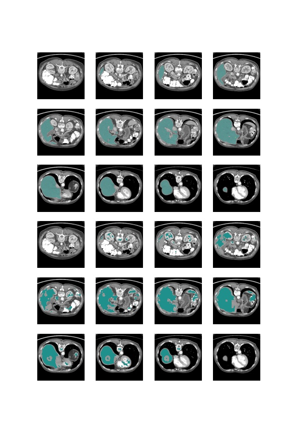
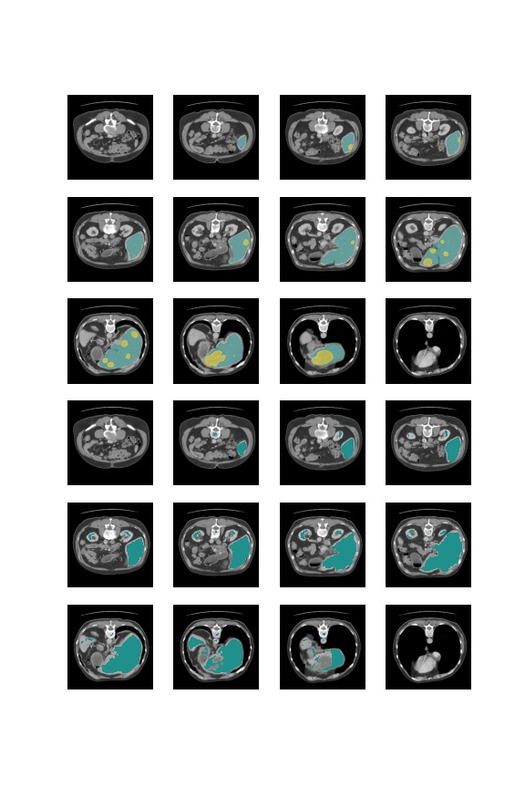

# 3D-DenseUNet-569

### 5 years later, reimplemented and fixed. A checkpoint and improvements will come as I find the time.

A reduced-depth PyTorch reconstruction of **3D-DenseUNet-569** from
[Alalwan et al., *Alexandria Engineering Journal* 60 (2021) 1231–1239][paper],
with architectural gap-fills from [Li et al., H-DenseUNet, arXiv:1709.07330][hdense].

The model segments **livers (class 1) and liver lesions (class 2)** in 3D CT
volumes from the [LiTS-2017 dataset][lits].
It uses real dense connectivity, 3D depthwise-separable convolutions (growth
rate 32, bottleneck 128), and a 5-level U-Net decoder.
See [Architecture fidelity](#architecture-fidelity) for why the shipped block
counts differ from the paper's figure.

[paper]: https://www.sciencedirect.com/science/article/pii/S1110016820305639
[hdense]: https://arxiv.org/pdf/1709.07330.pdf
[lits]: https://competitions.codalab.org/competitions/17094

---

## Install

```bash
pip install -e .
```

Requires Python 3.11+, PyTorch 2.x, nibabel, pyyaml, tqdm, matplotlib.
A CPU-only install is sufficient for all tests; a CUDA-capable GPU is needed
only for the full training run.

---

## Usage

The package installs a `dense-unet-3d` console entry point.
Copy the supplied configuration before editing dataset and output paths:

```bash
cp dense_unet_3d/config.yaml config.yaml
```

All subcommands take `--config <path/to/config.yaml>`.

### Train

```bash
dense-unet-3d train --config config.yaml
```

Runs the cascaded 2-phase training schedule (Phase A: 100 epochs × 10 steps;
Phase B: reload best checkpoint, 1000 epochs × 10 steps).
Checkpoints are written to the path specified in `config.yaml`.

### Evaluate

```bash
dense-unet-3d eval --config config.yaml --checkpoint <path/to/best.pt>
```

Evaluates on the configured validation directories and prints liver and tumor
Dice scores (per-case and global).

### Predict

```bash
dense-unet-3d predict --config config.yaml --checkpoint <path/to/best.pt> \
    --input <volume.nii.gz> --output <segmentation.nii.gz>
```

Runs inference on a single NIfTI volume and writes the predicted segmentation.

---

## Data setup

1. Download the [LiTS-2017 dataset][lits] (131 labeled training volumes).
2. Set `pathing.train_img_dirs` in `dense_unet_3d/config.yaml` to one or more
   directories holding labeled LiTS training volumes, and set
   `pathing.test_img_dirs` to separate labeled validation directories.
3. HU values are truncated to `[−200, 250]`; volumes are resized to
   `224×224×12`.

Training and validation directories must be separate. Evaluation does not
create a holdout split automatically.

---

## Architecture fidelity

This repository ships a **reduced-depth variant**, not a literally 569-layer
model.
The paper gives block counts (4, 12, 24, 36); the shipped implementation uses half-scale
block counts **(2, 6, 12, 18)** — preserving the paper's 1:3:6:9 ratio —
while retaining the paper-stated encoder hyperparameters:

- growth rate **g = 32** (authoritative, unchanged)
- bottleneck **128** channels (authoritative, unchanged)
- transition compression **0.5** (authoritative, unchanged)

This achieves **3,523,643 trainable parameters**, near the paper's reported
~3.6 M total. The ±15 % acceptance band (3.06 M–4.14 M) was chosen by this
repository; it is not a tolerance stated in the paper.

**Why not the paper's (4, 12, 24, 36)?**
The paper reports block counts (4, 12, 24, 36), growth rate 32, and about
3.6 M trainable parameters.
The paper does not specify enough implementation detail to independently
reconstruct its parameter count: its figure labels every dense-layer output as
32 but does not state the concatenated widths, convolution bias choices, or
decoder input widths. Under this repository's explicit DenseNet concatenation
and decoder mapping, these reported values cannot all be reproduced together.
With this repository's real dense concatenation, fixed bottleneck width, and
DS-Conv decoder mapping, the full-depth variant has **10,795,323 trainable
parameters**. That is a reconstruction result, not a count of the authors'
TensorFlow/Keras implementation.
Half-scale block counts (keeping g = 32) is the chosen in-band reconstruction;
it is not evidence that the paper's original implementation used these counts.

The implementation also uses DS-Conv in decoder blocks as a documented
efficiency deviation. The paper explicitly describes DS-Conv in dense blocks,
and Fig. 1 labels the decoder operations as Conv3D.

The architecture decision record and paper audit are in
[`docs/research/2026-06-21-denseunet569-architecture-decisions.md`](docs/research/2026-06-21-denseunet569-architecture-decisions.md)
and [`docs/research/2026-09-23-repository-audit.md`](docs/research/2026-09-23-repository-audit.md).

---

## Honesty / reporting note

The paper reports Dice on the **70-volume LiTS test set with hidden ground truth**.
This repository reports Dice on locally supplied validation volumes.
Absolute numbers differ and are **not directly comparable** to the paper's
leaderboard figures.
**Do not read the local holdout numbers as reproducing the leaderboard.**
The paper's results (liver Dice-per-case 96.2 / Dice-global 96.7;
tumor Dice-per-case 69.6 / Dice-global 80.7) are cited here only as the
published reference — clearly attributed to Alalwan et al. — and are not
measurements made by this repository.
The local validation set is a practical proxy for tracking training progress.

The audit corrected spatial-axis handling and mask interpolation during
preprocessing. Earlier checkpoints are not validated against this corrected
pipeline; retraining and real-data evaluation are still required.

---

## Results

The table below will be filled after the GPU training run.

| Metric | Liver | Tumor |
| --- | --- | --- |
| Dice per-case | *pending GPU run* | *pending GPU run* |
| Dice global | *pending GPU run* | *pending GPU run* |

Sample segmentations from a prior (pre-rewrite) checkpoint are shown below for
reference.
These images were produced by the earlier implementation and will be regenerated
after the full training run.

| Average case segmentation | Best case segmentation |
| :---: | :---: |
|  |  |

Top 3 rows: 12 equidistant ground-truth segmentation slices of a single CT
scan.
Bottom 3 rows: model predictions for the same slices.

---

## Roadmap

These phases are documented as future directions — they are **not built** in the
current release.

- **Phase 2 (owner improvements):**
  - *Full-depth (4, 12, 24, 36) configuration* — an optional g = 32 build
    (~10.8 M params) for users with the memory budget; this is the
    full block-count reconstruction; its parameter total exceeds the reported
    ~3.6 M, and its training memory requirement has not been measured.
  - Sliding-window patch inference/training, Dice / Tversky loss, modern
    optimizer (AdamW + cosine schedule).
- **Phase 3 (speculative):** open-weight finetuning from a published
  3D medical-segmentation backbone.

---

## Acknowledgements

Original implementation by [nguyenjus](https://github.com/NguyenJus) and
[wang1784](https://github.com/wang1784).
Completed in part using the Discovery cluster, supported by Northeastern
University's Research Computing team.
