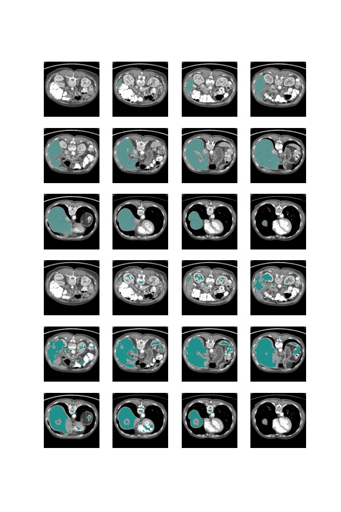
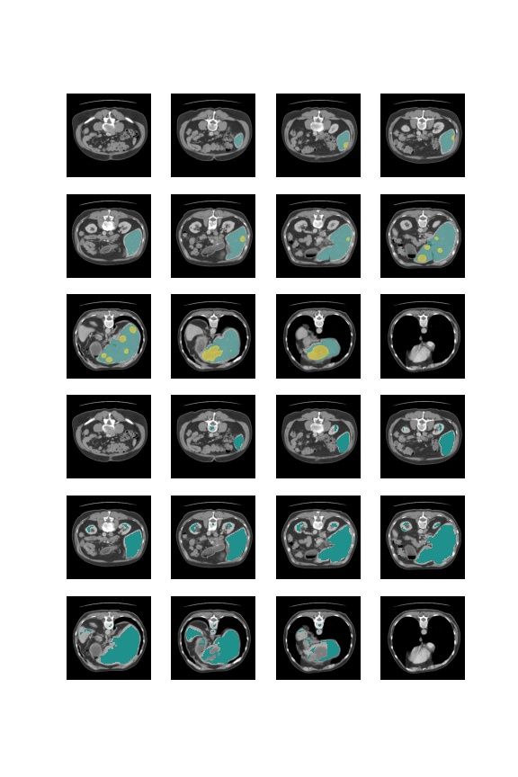

# 3D-DenseUNet-569

### 5 years later, reimplemented and fixed. A checkpoint and improvements will come as I find the time.

A PyTorch investigation of **3D-DenseUNet-569** from
[Alalwan et al., *Alexandria Engineering Journal* 60 (2021) 1231–1239][paper],
preserving the historical reduced-depth implementation and an explicit diagnostic
full-depth reconstruction. Architectural gap-fills draw from
[Li et al., H-DenseUNet, arXiv:1709.07330][hdense].

The model segments **livers (class 1) and liver lesions (class 2)** in 3D CT
volumes from the [LiTS-2017 dataset][lits].
The two model identities differ in depth, bottlenecks and decoder operations;
see [Architecture fidelity](#architecture-fidelity) for their exact contracts.

[paper]: https://www.sciencedirect.com/science/article/pii/S1110016820305639
[hdense]: https://arxiv.org/pdf/1709.07330.pdf
[lits]: https://competitions.codalab.org/competitions/17094

---

## Install

```bash
pip install -e .
```

Requires Python 3.11+, PyTorch 2.x, nibabel, pyyaml, tqdm, matplotlib.
A CPU-only install is sufficient for all tests; a CUDA-capable GPU is needed
only for the full training run.

---

## Usage

The package installs a `dense-unet-3d` console entry point.
Copy the supplied configuration before editing dataset and output paths:

```bash
cp configs/historical-reference.yaml config.yaml
```

Training, evaluation and inference take `--config <path/to/config.yaml>`;
`status` and `stop` take `--run-dir <model_save_dir>/<run_name>`.

### Train

```bash
dense-unet-3d train --config config.yaml --wall-seconds 28800 --budget-seconds 216000
```

Runs the cascaded 2-phase training schedule (Phase A: 100 epochs × 10 steps;
Phase B: reload best checkpoint, 1000 epochs × 10 steps).
The CLI prints the schedule and budget before allocating training resources.
It also reports the StepLR horizon and warns when the configured decay reduces
the final-epoch rate below one millionth of its starting value. The literal
paper schedule uses about `1.58e-32` for the final Phase B updates, then steps
to an unused post-phase rate of about `7.89e-33`. This is a reproduction ambiguity,
not evidence that 1000 epochs provide useful optimization.
Every completed epoch writes an atomic recovery checkpoint independently of best
validation improvement. SIGINT/SIGTERM request checkpoint-and-stop at an epoch
boundary; the full remaining epoch/validation/I/O may exceed the wall allocation.
Cumulative wall time is persisted across explicit resumes.

```bash
dense-unet-3d status --run-dir models/example_run --watch --max-seconds 3600
dense-unet-3d stop --run-dir models/example_run
dense-unet-3d resume --config config.yaml --wall-seconds 28800
```

No automatic restart is installed. Legacy checkpoints without continuation state
cannot exactly resume. Launch, recovery after host reboot, runtime accounting,
validation cadence, ownership and bounded evaluation are documented in
[training operations](docs/training-operations.md). CPU `--dry-run` never selects
CUDA; a real GPU run requires separate authorization.

### Preflight

```bash
dense-unet-3d preflight --config config.yaml
```

Audits every training and validation NIfTI header without creating a model or
using CUDA. Add `--full-decode` to also read CT and mask voxels, reject
non-finite CT values, and verify mask labels are integers in `{0, 1, 2}`.
Training runs this full-decode preflight automatically before model creation.

### Evaluate

```bash
dense-unet-3d eval --config config.yaml --checkpoint <path/to/best.pt>
```

Evaluates on the configured validation directories and prints liver and tumor
Dice scores (per-case and global). Default bounds are 300 seconds including setup
and 100 batches; override with `--wall-seconds` and `--max-batches`. Incomplete
evaluation withholds metrics. Optional `train/resume --final-eval` also respects
the remaining persistent training budget.
Metadata-free historical checkpoints require the explicit
`--allow-legacy-preprocessing` opt-in. The warning means their sampling grid is
unknown and resulting metrics may not be comparable; known preprocessing
mismatches remain errors.

### Predict

```bash
dense-unet-3d predict --config config.yaml --checkpoint <path/to/best.pt> \
    --input <volume.nii.gz> --output <segmentation.nii.gz>
```

Runs inference on a single NIfTI volume and writes the predicted segmentation.
The same `--allow-legacy-preprocessing` boundary applies to metadata-free
historical checkpoints.

---

## Data setup

1. Download the [LiTS-2017 dataset][lits] (131 labeled training volumes).
2. Set `pathing.train_img_dirs` in the copied `config.yaml` to one or more
   directories holding labeled LiTS training volumes, and set
   `pathing.test_img_dirs` to separate labeled validation directories.
3. HU values are truncated to `[−200, 250]`; volumes are resized to
   `224×224×12`.

Training and validation directories must be separate. Evaluation does not
create a holdout split automatically.

---

## Architecture fidelity

Two explicit model identities are available:

- `historical_reduced`: the existing (2,6,12,18) graph and DS decoder,
  3,523,643 parameters, retained for historical weight evaluation.
- `figure_skip_reconstruction_v1`: full (4,12,24,36) counts, standard decoder,
  printed bottlenecks (128,128,128,32), and resized figure-source skips,
  64,591,723 parameters. This is a diagnostic reconstruction with unresolved
  topology/framework assumptions, not the verified author model.

The paper's 3.6M and 36.27M parameter claims conflict. The old ±15% count band
has been removed as an acceptance test; neither graph is justified by matching
those claims. Exact source-backed topology, epoch semantics and data retention
remain gates. Full-FOV 224×224 resizing erases some native tumor components, so
that representation is blocked for long training. Native in-plane tiling is an
explicitly investigated follow-up, not a silently selected replacement.

See the [implementation and evidence ledger](docs/research/2026-09-30-reconstruction-implementation.md),
[model manifest](docs/research/2026-09-30-model-manifest.json), and
[historical decision record](docs/research/2026-06-21-denseunet569-architecture-decisions.md).
`dense_unet_3d/config.yaml` and `configs/reconstruction-reference.yaml` preserve
the literal schedule but refuse launch. `configs/reconstruction-diagnostic.yaml` is a separate bounded
engineering protocol. Historical examples below retain their original contract.

---

## Honesty / reporting note

The paper reports Dice on the **70-volume LiTS test set with hidden ground truth**.
This repository reports Dice on locally supplied validation volumes.
Absolute numbers differ and are **not directly comparable** to the paper's
leaderboard figures.
**Do not read the local holdout numbers as reproducing the leaderboard.**
The paper's results (liver Dice-per-case 96.2 / Dice-global 96.7;
tumor Dice-per-case 69.6 / Dice-global 80.7) are cited here only as the
published reference — clearly attributed to Alalwan et al. — and are not
measurements made by this repository.
The local validation set is a practical proxy for tracking training progress.

The audit corrected spatial-axis handling and mask interpolation during
preprocessing. Earlier checkpoints are not validated against this corrected
pipeline; retraining and real-data evaluation are still required.
The September 30 audit additionally corrects image/mask resize coordinate grids;
managed checkpoints made with the older grid are refused on exact resume.
Whole-volume compression to 12 slices can still erase lesions. The
`historical_reduced` reference folds tumor into liver during Phase A, an
implementation choice not specified by the paper's two-stage training description;
the diagnostic reconstruction keeps all three classes in both phases. These remain
barriers to claiming reproduced results; see the
[training run audit](docs/research/2026-09-30-training-run-audit.md).

---

## Results

The table below will be filled after the GPU training run.

| Metric | Liver | Tumor |
| --- | --- | --- |
| Dice per-case | *pending GPU run* | *pending GPU run* |
| Dice global | *pending GPU run* | *pending GPU run* |

Sample segmentations from a prior (pre-rewrite) checkpoint are shown below for
reference.
These images were produced by the earlier implementation and will be regenerated
after the full training run.

| Average case segmentation | Best case segmentation |
| :---: | :---: |
|  |  |

Top 3 rows: 12 equidistant ground-truth segmentation slices of a single CT
scan.
Bottom 3 rows: model predictions for the same slices.

---

## Roadmap

These phases are documented as future directions — they are **not built** in the
current release.

- **Phase 2 (owner improvements):**
  - Resolve the diagnostic reconstruction's remaining evidence and learning gates.
  - Native in-plane tile integration beyond the implemented native-depth slabs.
  - Separately named Dice / Tversky loss or AdamW/cosine experiments; these are
    not corrections to the paper recipe.
- **Phase 3 (speculative):** open-weight finetuning from a published
  3D medical-segmentation backbone.

---

## Acknowledgements

Original implementation by [nguyenjus](https://github.com/NguyenJus) and
[wang1784](https://github.com/wang1784).
Completed in part using the Discovery cluster, supported by Northeastern
University's Research Computing team.
